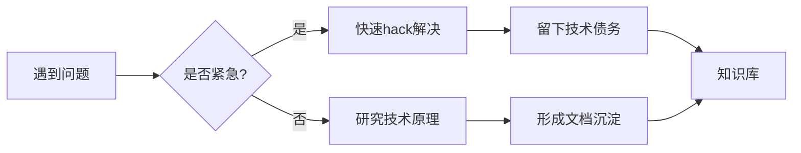

# 学习笔记与项目踩坑记录 🚀  
> 记录技术成长路上的经验总结与避坑指南，持续更新中  

---

### 前端专项  
| 技术栈       | 工具                  | 框架                |
|--------------|-----------------------|----------------------|
| React        | uniapp                 | webpack |
| Vue         | koa                     | rsbuild        |

---

## 🌱 持续学习  
| 资源类型       | 推荐项目                          |
|----------------|-----------------------------------|
| 技术播客       | [Syntax.fm](https://syntax.fm)    |
| 开源项目       | [uniapp组件](https://github.com/vitejs/vite) |

---

## 🤝 贡献指南  
欢迎补充你的经验：  
1. Fork本仓库  
2. 在`experiences/`目录添加Markdown文件  
3. 提交PR并描述经验场景  

> 所有内容遵循 [CC BY-NC-SA 4.0](LICENSE) 许可

---

> 本仓库最后更新：{{date}}  
> 保持空杯心态，持续迭代认知！ ✨
