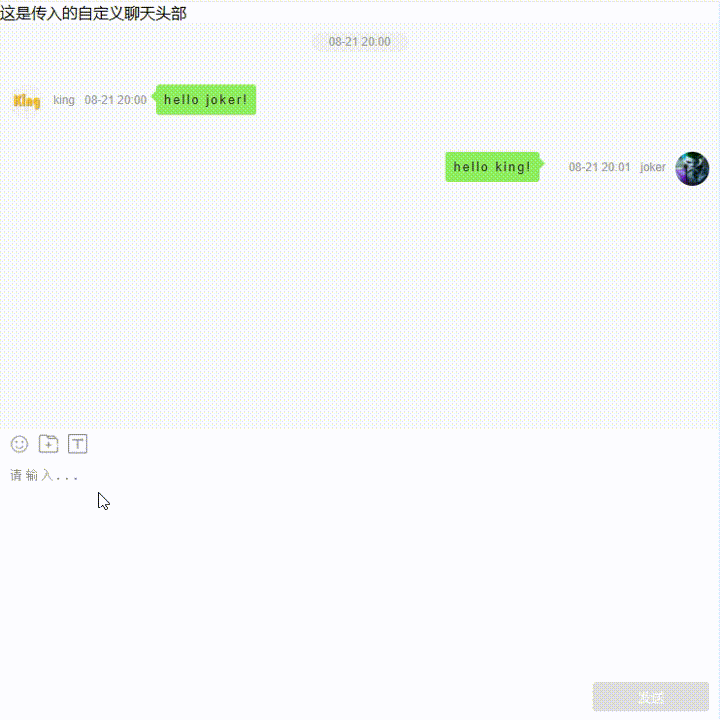

# @lhxjoker/chat

## 📦 介绍

聊天组件，支持发送文本、图片、表情、快捷短语

## 👀 预览



## 🚀 安装

```bash
npm install @lhxjoker/chat
or
yarn add @lhxjoker/chat
```

## Props

| 参数 | 说明 | 类型 | 默认值 |
| --- | --- | --- | --- |
| ChatHeader | 聊天窗口头部 | ReactNode | - |
| contact | 当前聊天对象信息 | object | - |
| me | 本人信息 | object | - |
| commonWords | 快捷发送短语List | array | - |
| inputHeight | 聊天窗口输入窗默认高度，支持鼠标自动调整 | string | - |
| onRecord | 是否只展示聊天记录 | boolean | false |
| chatList | 聊天记录 | array | - |
| onSend | 点击发送消息的回掉函数 | function | - |
| style | 样式 | object | - |

contact || me 
| name | 描述 | 类型 | 默认值 |
| --- | --- | --- | --- |
| id | 用户标示，需要唯一 | number | - |
| avatar | 用户头像 | string | - |
| nickname | 用户昵称 | string | - |
| message | 最近一条信息 | string | - |
| date | 信息更新时间 | string | - |
| desc | 用户简介(用于在聊天框头部显示) | string | - |

chatList
| name | 描述 | 类型 | 默认值 |
| --- | --- | --- | --- |
| id | 聊天标示，需要唯一 | number | - |
| date | 消息产生时间 | number | - |
| user | 当前消息发起人的信息 | object | - |
| message | 消息内容主体 | object | - |

message
| name | 描述 | 类型 | 默认值 |
| --- | --- | --- | --- |
| type | 消息类型 | string | - |
| content | 消息内容 | string | - |
| extra | 额外数据 | object | - |


## events
| name | 描述 | 类型 | 默认值 |
| --- | --- | --- | --- |
| onSend | 点击发送消息的回掉函数 | function | (msg) => {} |

msg格式通消息体

## 示例

```javascript

import React, {
  useState,
} from 'react';
import Chat from '@lhxjoker/chat';

const _initChatList = [
  {
    _id: 1,
    date: 1755777600000,
    user: {
      id: 1,
      avatar: 'https://img95.699pic.com/element/40113/4394.png_860.png',
      nickname: 'king',
      desc: '这是我的第一条信息',
    },
    message: { type: 'text', content: 'hello joker!' },
  },
  {
    _id: 2,
    date: 1755777660000,
    user: {
      id: 2,
      avatar:
        'https://img-baofun.zhhainiao.com/pcwallpaper_ugc_mobile/static/8caf600f71d95fcce80426958cfba305.jpg?x-oss-process=image%2fresize%2cm_lfit%2cw_640%2ch_1138',
      nickname: 'joker',
      desc: '这是我的第一条信息',
    },
    message: { type: 'text', content: 'hello king! ' },
  },
];

function Index() {
  const contact = {
    id: 1,
    avatar: 'https://img95.699pic.com/element/40113/4394.png_860.png',
    nickname: 'king',
    message: '这是一条信息',
    date: '02-11',
    desc: '大家好 我是 king',
  };
  const my = {
    id: 2,
    avatar:
      'https://img-baofun.zhhainiao.com/pcwallpaper_ugc_mobile/static/8caf600f71d95fcce80426958cfba305.jpg?x-oss-process=image%2fresize%2cm_lfit%2cw_640%2ch_1138',
    nickname: 'joker',
    message: '这是一条信息',
    date: '02-11',
    desc: '大家好 我是 joker',
  };

  const [chatList, setChatList] = useState(_initChatList);

  const _sendMsg = (msg) => {
    setChatList((list) => [...list, msg]);
  };

  return (
    <div className="chat" style={{ width: '100vw', height: '100vh' }}>
      <Chat
        ChatHeader={<div>聊天头部</div>}
        contact={contact} //当前聊天对象
        me={my} //本人对象
        commonWords={['你好', '吃了吗？']} //快捷发送短语List
        onRecord={false} //是否只展示聊天记录 true适配管理端 false适配医生端
        chatList={chatList} //需要渲染的聊天记录
        onSend={(msg) => {
          _sendMsg(msg);
        }} //点击发送消息的回掉函数
        inputHeight={'300px'} //聊天框默认高度
        style={{
          width: '100%',
          height: '100%',
        }}
      />
    </div>
  );
}

export default Index;

```

## 作者

```bash
liuhaixu  地址: https://github.com/lhx-liu
```


```bash
V1.0.0
聊天组件首次发布。支持发送表情，文本、图片、快捷短语发送。