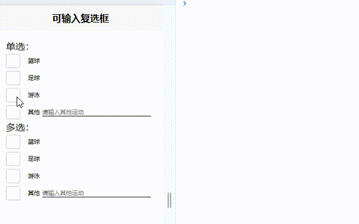

# 可输入复选框（Checkbox Input）组件

## 🌟 组件介绍
可输入复选框是一款基于Uniapp开发的增强型表单组件，它完美结合了复选框的选择功能和输入框的文本输入功能，让用户在选择选项的同时，还能针对该选项输入额外的内容，极大地提升了表单的灵活性和用户体验。

## 📱 预览效果


## 🚀 快速开始

### 安装方式

#### 方式一：通过HBuilderX导入插件
1. 在HBuilderX中打开你的项目
2. 点击工具栏的"工具" -> "插件安装"
3. 在插件市场搜索"可输入复选框"或插件ID
4. 点击"导入插件"

https://ext.dcloud.net.cn/plugin?id=25167


### 引入组件
本组件符合easycom组件规范,直接在页面中使用，无需引入

```

## 📋 基本用法

```vue
<template>
	<view style="padding: 40rpx;">
		<view>
			单选：
		</view>
		<view>
			<checkbox-input :localdata="range" @change="change1"></checkbox-input>
		</view>
		<view>
			多选：
		</view>
		<view>
			<checkbox-input multiple :localdata="range" @change="change2"></checkbox-input>
		</view>
	</view>
</template>

<script>
	export default {
		data() {
			return {
				range: [{
					"value": '0',
					"text": "篮球"
				}, {
					"value": '1',
					"text": "足球"
				}, {
					"value": '2',
					"text": "游泳"
				}, {
					"value": '3',
					"text": "其他",
					"allowInput": true,
					"inputValue": '',
					"placeholder": '请输入其他运动'
				}]
			}
		},
		methods: {
			change1(value, value1, arr) {
				console.log('value', value);
				console.log('value1', value1);
				console.log('arr', arr);
			},
			change2(value, value1, arr) {
				console.log('value', value);
				console.log('value1', value1);
				console.log('arr', arr);
			}
		}
	}
</script>

<style>

</style>
```

## ⚙️ 属性说明

| 属性名 | 类型 | 默认值 | 说明 |
|-------|------|-------|------|
| localdata | Array | [] | 复选框数据源 |
| multiple | Boolean | false | 是否支持多选 |
| activeBackgroundColor | String | '#2979ff' | 选中时的背景色 |
| activeBorderColor | String | '#2979ff' | 选中时的边框颜色 |
| iconColor | String | '#ffffff' | 选中时的图标颜色 |

### localdata数组中每个对象的属性

| 属性名 | 类型 | 必填 | 说明 |
|-------|------|------|------|
| value | String/Number | 是 | 选项的唯一标识 |
| text | String | 是 | 选项的显示文本 |
| checked | Boolean | 否 | 默认是否选中 |
| allowInput | Boolean | 否 | 是否允许输入文本 |
| placeholder | String | 否 | 输入框的占位符文本 |
| inputValue | String | 否 | 输入框的初始值 |

## 📢 事件说明

| 事件名 | 说明 | 回调参数 |
|-------|------|---------|
| change | 当选择状态或输入内容改变时触发 | ids: 选中项的value数组<br>idValues: 选中项的值数组（如果有输入框则为输入值，否则为value）<br>filterArr: 选中项的完整对象数组 |

## 📝 更新日志

### v1.0.0 (2025-09-16)
- ✨ 首次发布可输入复选框组件
- 支持单选和多选模式
- 支持自定义选中状态的颜色
- 支持动态数据绑定和事件回调

## 👨‍💻 作者信息
- 作者：[liuhaixu](https://github.com/lhx-liu)  <!-- 替换为实际作者 -->
- GitHub：https://github.com/lhx-liu  <!-- 替换为实际GitHub链接 -->

## 📍 组件地址
[https://ext.dcloud.net.cn/plugin?id=25167](https://ext.dcloud.net.cn/plugin?id=25167)

## 💻 组件源码
[https://github.com/lhx-liu/lhx-components](https://github.com/lhx-liu/lhx-components)

## 📄 开源协议
本项目采用 [MIT License](https://opensource.org/licenses/MIT) 开源协议

## 💌 反馈与建议
如有任何问题或建议，欢迎在插件市场留言或提交Issue。

## 👏 鸣谢
感谢所有使用和支持本组件的开发者！