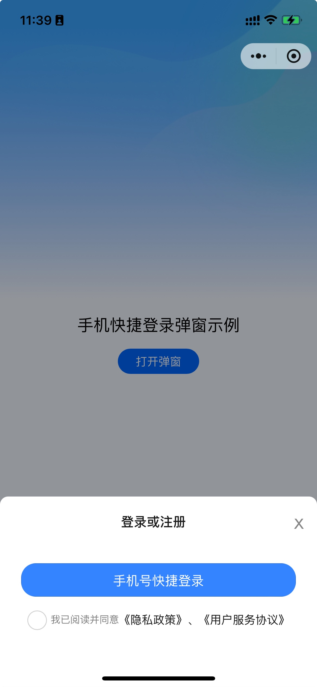
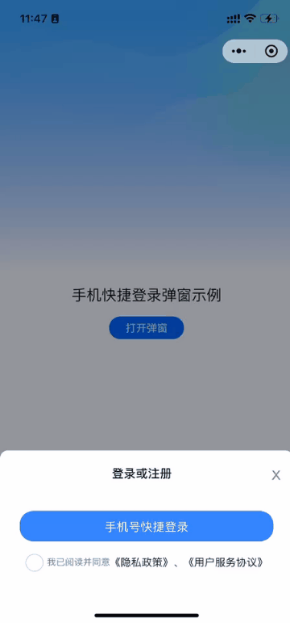

# Phone Login 手机号快捷登录组件

<div align="center" style="display: flex; justify-content: space-around;">
  
  
</div>

## 📝 组件介绍

将手机号快捷登录弹窗、用户隐私协议进行统一封装。

### 🌟 组件特性

1. 通过 `show` 属性控制显隐
2. 组件支持高度自定义，弹窗高度、背景颜色、圆角支持自定义
3. 登录按钮支持样式自定义
4. 隐私协议和用户服务协议提示语支持自定义
5. 组件依赖官方 uni-popup，uni-popup 属性均对外放开

---

## 📦 基本信息

### 📍 组件地址
[https://p.dcloud.net.cn/plugin?id=19369](https://p.dcloud.net.cn/plugin?id=19369)

### 💻 组件源码
[https://github.com/lhx-liu/lhx-components](https://github.com/lhx-liu/lhx-components)

### 📄 更新日志
``bash
更新 1.0.0版本
初始版本
```

---

## 🚀 快速开始

### 📋 兼容性
```bash
端：只微信小程序
vue2 vue3 支持
```

### ⬇️ 安装方式
```bash
请在uniapp插件市场安装

注意：此组件依赖官方uni-popup弹窗 请先安装uni-popup
```

### 🔧 引入方式
```bash
本组件符合easycom组件规范,直接在页面中使用
```

---

## 🎯 使用示例

```javascript
<template>
	<view class="phoneLogin-box">
		<view class="text">
			手机快捷登录弹窗示例
		</view>
		<view class="btn" @click="openLogin">
			打开弹窗
		</view>
		<phone-login
			:show="show"
			privacyUrl="/pages/login/privacy"
			userAgreementUrl="/pages/login/userAgreement"
			@maskClick="maskClick"
			@loginSuccessFun="loginSuccessFun">
		</phone-login>
	</view>
</template>

<script>
	export default {
		data() {
			return {
				show: false
			}
		},
		methods: {
			openLogin() {
				this.show = true;
			},
			maskClick() {
				this.show = false;
			},
			loginSuccessFun(code) {
				this.show = false;
				uni.showToast({
					icon: 'none',
					duration: 10000,
					title:'获取手机code==>' + code
				});
			}
		}
	}
</script>
```

---

## ⚙️ Props 属性

### 基础属性

| 属性名 | 类型 | 默认值 | 说明 |
|--------|------|--------|------|
| show | Boolean | false | 登录弹窗是否展示 |
| safeArea | Boolean | true | 是否启用底部安全区域 |
| openType | String | bottom | 登录弹窗弹出位置，可选值同 uni-popup 官方文档 |
| title | String | - | 弹窗标题 |

### 样式属性

| 属性名 | 类型 | 默认值 | 说明 |
|--------|------|--------|------|
| backColor | String | - | 弹窗背景颜色 |
| height | String | - | 弹窗高度 |
| borderRadius | String | - | 弹窗圆角 |
| btnCustomStyle | String | - | 登录按钮自定义样式 |
| btnTip | String | - | 登录按钮提示 |

### 协议属性

| 属性名 | 类型 | 默认值 | 说明 |
|--------|------|--------|------|
| showPrivacy | Boolean | true | 是否展示隐私协议 |
| agreeTip | String | - | 隐私协议提示语 |
| privacyName | String | - | 隐私协议名称 |
| privacyUrl | String | - | 隐私协议跳转页面url |
| userAgreementName | String | - | 用户服务协议名称 |
| userAgreementUrl | String | - | 用户服务协议url |

---

## 📡 Events 事件

| 事件名 | 说明 | 回调参数 |
|--------|------|----------|
| loginSuccessFun | 获取手机号code成功的回调 | code |
| maskClick | 点击遮罩触发 | - |

---

## 👨‍💻 作者信息

[liuhaixu](https://github.com/lhx-liu)

### 版本信息
```bash
V1.0.0
手机号快捷登录弹窗
```