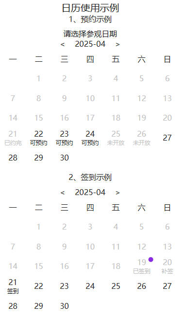

# UNV Calendar 日历组件

<p align="center">
  
</p>

## 📝 组件介绍

封装日历组件，可以在日历上进行预约或签到。

### 📄 更新日志
```bash
更新 1.1.0版本
更新内容：
1.增加支持日历月份前后切换，不再只展示当前月份和下个月
2.增加支持限制最小月份 最大月份，默认不限制
```

### 🌟 组件特性

1. 一款自定义封装的日历组件
2. 可以用于门票预约、打卡签到等场景
3. 增加支持限制最小月份 最大月份，默认不限制

---

## 📦 基本信息

### 📍 组件地址
[https://p.dcloud.net.cn/plugin?id=23129](https://p.dcloud.net.cn/plugin?id=23129)

### 💻 组件源码
[https://github.com/lhx-liu/lhx-components](https://github.com/lhx-liu/lhx-components)

---

## 🚀 快速开始

### 📋 兼容性
```bash
端：只测试过H5、微信小程序，其他端未测试
框架：vue2、vue3
```

### ⬇️ 安装方式
```bash
请在uniapp插件市场安装
```

### 🔧 引入方式
```bash
本组件符合easycom组件规范,直接在页面中使用
```

---

## 🎯 使用示例

```vue
<template>
	<view class="test-box">
		<view class="text">
			日历使用示例
		</view>
		<view class="text1">1、预约示例</view>
		<view class="calendar-box">
			<unv-calendar
				:selected="openDays1"
				@changeDay="changeDay"
				:monthCanChange="true"
				:minMonth="minMonth"
				:maxMonth="maxMonth">
			</unv-calendar>
		</view>
		<view class="text1">2、签到示例</view>
		<view class="calendar-box">
			<unv-calendar
				:selected="openDays2"
				:title="false"
				@changeDay="changeDay"
				:monthCanChange="true"
				:minMonth="minMonth"
				:maxMonth="maxMonth">
			</unv-calendar>
		</view>
	</view>
</template>

<script>
	export default {
		data() {
			return {
				minMonth: '2025-07',
				maxMonth: '2025-10',
				openDays1: [
					{
						date: '2025-08-18',
						disable: true,
						info: '已约完'
					},
					{
						date: '2025-08-19',
						disable: true,
						info: '已约完'
					},
					{
						date: '2025-08-20',
						disable: true,
						info: '已约完'
					},
					{
						date: '2025-08-21',
						disable: true,
						info: '已约完'
					},
					{
						date: '2025-08-22',
						disable: false,	
						info: '可预约'
					},
					{
						date: '2025-08-23',
						disable: false,	
						info: '可预约'
					},
					{
						date: '2025-08-24',
						disable: false,	
						info: '可预约'
					},
					{
						date: '2025-08-25',
						disable: true,	
						info: '未开放'
					},
					{
						date: '2025-08-26',
						disable: true,	
						info: '未开放'
					}
				],
				openDays2: [
					{
						date: '2025-08-10',
						showDot: true,
						disable: true,
						info: '已签到'
					},
					{
						date: '2025-08-11',
						showDot: false,
						info: '补签'
					},
					{
						date: '2025-08-12',
						showDot: false,
						info: '签到'
					}
				]
			}
		},
		methods: {
			changeDay(date, day) {
				console.log('date', date);
				console.log('day', day);
			},
		}
	}
</script>
```

---

## ⚙️ Props 属性

### 属性说明

| 属性名 | 类型 | 默认值 | 说明 |
|--------|------|--------|------|
| selected | Array[dateObj] | [] | 打点数组，dateObj为日期对象 |
| monthCanChange | Boolean | false | 是否可以切换月份 |
| title | Boolean Or String | true | 是否显示标题, 传入则按照传入内容显示标题 |
| minMonth | String |  | 最小月份，格式：YYYY-MM |
| maxMonth | String |  | 最大月份，格式：YYYY-MM |


### dateObj 说明

| 属性名 | 类型 | 默认值 | 说明 |
|--------|------|--------|------|
| date | String | - | 日期（格式：YYYY-MM-DD） |
| disable | Boolean | false | 是否禁用该日期 |
| info | String | - | 提示信息 |
| showDot | Boolean | false | 是否显示圆点 |

> 如果需要支持更多属性，请自行 fork 代码进行扩展

---

## 📡 Events 事件

### changeDay 事件

日期点击事件

| 参数名 | 类型 | 说明 |
|--------|------|------|
| date | String | 选中的日期 |
| day | Object | 日期对象，包含 date、disable、info、showDot 属性 |

---

## 👨‍💻 作者信息

[liuhaixu](https://github.com/lhx-liu)

### 版本信息
```bash
V1.1.0
日历组件
```


