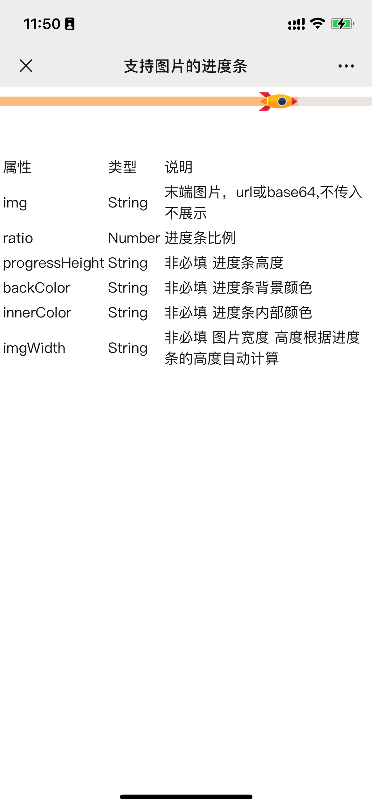

# UNV Progress 带图片的进度条组件

<div align="center">
  
</div>

## 📝 组件介绍

带图片的进度条组件，可以在进度条末端显示自定义图片。

---

## 📦 基本信息

### 📍 组件地址
[https://p.dcloud.net.cn/plugin?id=19258](https://p.dcloud.net.cn/plugin?id=19258)

### 💻 组件源码
[https://github.com/lhx-liu/lhx-components](https://github.com/lhx-liu/lhx-components)

### 📄 更新日志
```bash
更新 1.0.0版本
初始版本
```

---

## 🚀 快速开始

### 📋 兼容性
```bash
端：H5 微信小程序 支持；其他也均支持 未测试。
vue2 vue3 支持
```

### ⬇️ 安装方式
```bash
请在uniapp插件市场安装
```

### 🔧 引入方式
```bash
本组件符合easycom组件规范,直接在页面中使用
```

---

## 🎯 使用示例

```javascript
<template>
	<view class="content">
		<unv-progress :img="img" :ratio="80"></unv-progress>
		{/* //其它代码 */}
	</view>
</template>

<script>
	export default {
		data() {
			return {
				img: 'http://192.168.0.102:4010/img/index.png'
			}
		}
	}
</script>
```

---

## ⚙️ Props 属性

### 属性说明

| 属性名 | 类型 | 默认值 | 说明 |
|--------|------|--------|------|
| img | String | - | 进度条末端图片URL或base64 |
| ratio | Number | - | 进度条比例 |
| progressHeight | String/Number | - | 进度条高度 |
| backColor | String | - | 进度条背景颜色 |
| innerColor | String | - | 进度条内部颜色 |
| imgWidth | String/Number | - | 图片宽度，高度根据进度条高度自动计算 |

---

## 👨‍💻 作者信息


[liuhaixu](https://github.com/lhx-liu)

### 版本信息
```bash
V1.0.0
带图片的进度条组件
```