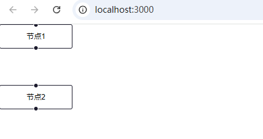
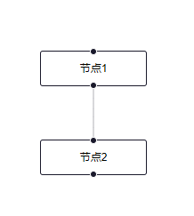
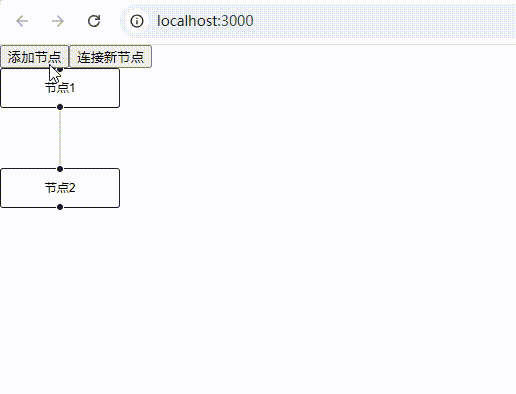
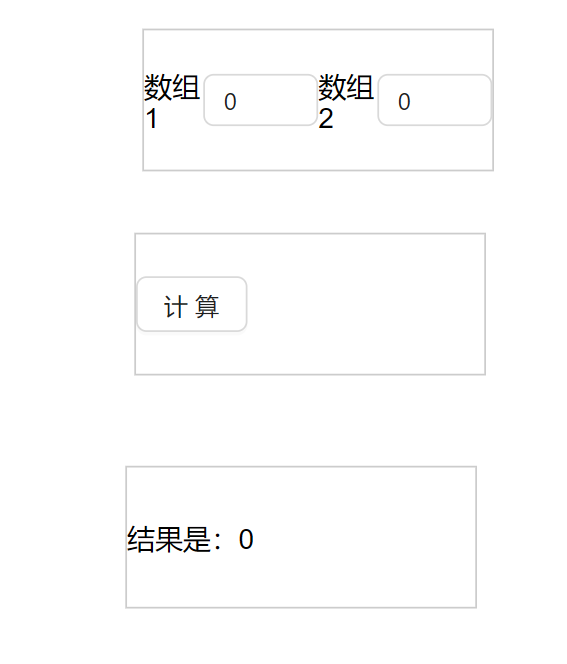
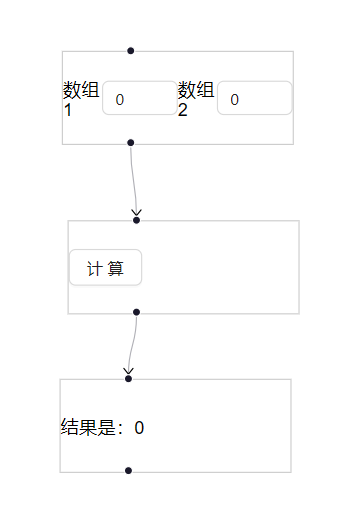
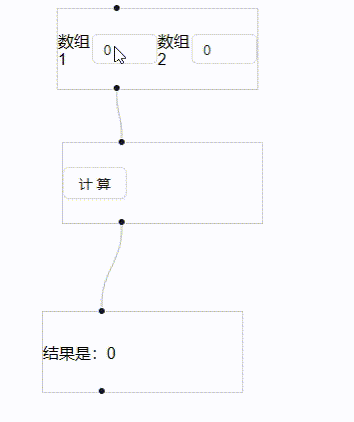

# XYFlow 节点工作流组件（一）

## 1. 什么是 XYFlow？

XYFlow 是一个基于 React 的流程图组件库，基于 React Flow 构建。它提供了一个简单的 API，用于创建和管理流程图。

### 1.1 主要功能

XYFlow 允许用户：
- 创建流程图
- 添加节点和连线
- 拖动节点
- 删除节点和连线
- 修改节点和连线的属性
- 保存和加载流程图
- 导入和导出流程图

### 1.2 官方资源

官方文档：[XYFlow 官方文档](https://reactflow.dev/api-reference)

---

## 2. XYFlow 的使用

### 2.1 安装依赖

```bash
npm install @xyflow/react
```

### 2.2 项目中引入 XYFlow

```jsx
import { ReactFlow } from '@xyflow/react';
// 注意这里引入样式文件
import '@xyflow/react/dist/style.css';
```

### 2.3 创建流程图

> 注意：ReactFlow 组件必须放在一个有宽高属性的容器中，否则会报错。

```jsx
<div className="xyflow" style={{ width: '100vw', height: '100vh' }}>
  <ReactFlow />
</div>
```

完整代码示例：

```jsx
import React from 'react';
import { ReactFlow } from '@xyflow/react';
import '@xyflow/react/dist/style.css';

function XyFlow() {
  return (
    <div className="xyflow" style={{ width: '100vw', height: '100vh' }}>
      <ReactFlow />
    </div>
  );
}

export default XyFlow;
```

此时界面上还看不到任何内容，因为流程图由节点和连线两部分组成。

### 2.4 引入节点

节点管理可以使用 `useNodesState` 这个 hooks 来管理工作流中的所有节点。`useNodesState` 和 React 中的 hooks 一样，为我们管理节点提供了便利。

```jsx
import { useNodesState } from '@xyflow/react';

const initialNodes = [
  {
    id: '1',
    position: { x: 0, y: 0 },
    data: { label: '节点1' },
  }
];

const [nodes, setNodes, onNodesChange] = useNodesState(initialNodes);
```

参数说明：
- `nodes`: 当前节点数组。可以将它直接传递给 `<ReactFlow />` 的 `nodes` 属性
- `setNodes`: 设置节点数组的方法
- `onNodesChange`: 节点数组改变时触发。可以直接将它传递给 `<ReactFlow />` 的 `onNodesChange` 属性

现在我们继续往上面的示例添加 2 个节点看下效果：

```jsx
import React from 'react';
import { ReactFlow, useNodesState } from '@xyflow/react';
import '@xyflow/react/dist/style.css';

const initialNodes = [
  {
    id: '1',
    position: { x: 0, y: 0 },
    data: { label: '节点1' },
    width: 120,
    height: 40,
  },
  {
    id: '2',
    position: { x: 0, y: 60 },
    data: { label: '节点2' },
    width: 120,
    height: 40,
  },
];

function XyFlow() {
  const [nodes, setNodes, onNodesChange] = useNodesState(initialNodes);
  return (
    <div className="xyflow" style={{ width: '100vw', height: '100vh' }}>
      <ReactFlow nodes={nodes} onNodesChange={onNodesChange} />
    </div>
  );
}

export default XyFlow;
```

效果如下：



### 2.5 引入连线

连线管理可以使用 `useEdgesState` 这个 hooks 来管理工作流中的所有连线。`useEdgesState` 和 React 中的 hooks 一样，为我们管理连线提供了便利。

```jsx
import { useEdgesState } from '@xyflow/react';

const initialEdges = [
  {
    id: '1',
    source: '1',
    target: '2',
  }
];

const [edges, setEdges, onEdgesChange] = useEdgesState(initialEdges);
```

参数说明：
- `edges`: 当前连线数组。可以将它直接传递给 `<ReactFlow />` 的 `edges` 属性
- `setEdges`: 设置连线数组的方法
- `onEdgesChange`: 连线数组改变时触发。可以直接将它传递给 `<ReactFlow />` 的 `onEdgesChange` 属性

现在我们将上面 2 个节点通过连线连起来看下效果：

```jsx
/*
 * @Description: 流程设计器
 * @Author: liuhaixu
 * @Date: 2025-08-08 15:08:10
 * @Last Modified by: liuhaixu
 * @Last Modified time: 2025-08-08 15:37:16
 */
import React from 'react';
import { ReactFlow, useNodesState, useEdgesState } from '@xyflow/react';
import '@xyflow/react/dist/style.css';

const initialNodes = [
  {
    id: '1',
    position: { x: 0, y: 0 },
    data: { label: '节点1' },
    width: 120,
    height: 40,
  },
  {
    id: '2',
    position: { x: 0, y: 100 },
    data: { label: '节点2' },
    width: 120,
    height: 40,
  },
];

const initialEdges = [
  {
    id: '1',
    source: '1',
    target: '2',
  },
];

function XyFlow() {
  const [nodes, setNodes, onNodesChange] = useNodesState(initialNodes);
  const [edges, setEdges, onEdgesChange] = useEdgesState(initialEdges);
  return (
    <div className="xyflow" style={{ width: '100vw', height: '100vh' }}>
      <ReactFlow
        nodes={nodes}
        edges={edges}
        onNodesChange={onNodesChange}
        onEdgesChange={onEdgesChange}
      />
    </div>
  );
}

export default XyFlow;
```

效果如下：



### 2.6 手动添加节点和连线

我们可以通过 `useNodesState` 的 `setNodes` 手动添加节点，通过 `useEdgesState` 的 `setEdges` 手动添加连线。

```jsx
// ...其它代码
const [nodes, setNodes, onNodesChange] = useNodesState(initialNodes);
const [edges, setEdges, onEdgesChange] = useEdgesState(initialEdges);

const _addNode = () => {
  setNodes([
    ...nodes,
    {
      id: '3',
      position: { x: 0, y: 200 },
      data: { label: '节点3' },
      width: 120,
      height: 40,
    },
  ]);
};

const _addEdge = () => {
  setEdges([
    ...edges,
    {
      id: '2',
      source: '2',
      target: '3',
    },
  ]);
};
// ...其它代码
```

效果如下：



### 2.7 自定义节点

在实际项目或需求中，节点的样式和内容可能会有差异。因此，我们需要自定义节点。

#### 2.7.1 定义 nodeTypes

使用 `nodeTypes` 属性来自定义节点类型：

```tsx
type NodeTypes = {
  [key: string]: React.ComponentType<NodeProps>;
};
```

现在我们构造一个简单的自定义流程图：
- 开始节点包含 2 个输入框
- 中间节点为计算按钮节点，点击后会计算开始节点输入框的值的和
- 最后为结果节点展示开始节点两个输入框的和

首先声明这三种 nodeTypes：

```jsx
const nodeTypes = {
  startNode: StartNode,
  endNode: EndNode,
  btnNode: BtnNode,
};
```

将 nodeTypes 传入 ReactFlow 组件中：

```jsx
<ReactFlow
  nodes={nodes}
  edges={edges}
  nodeTypes={nodeTypes}
  onNodesChange={onNodesChange}
  onEdgesChange={onEdgesChange}
/>
```

#### 2.7.2 定义自定义节点组件

分别定义 StartNode、EndNode、BtnNode 组件：

```jsx
// StartNode.jsx
import React, { useState } from 'react';
import { InputNumber } from 'antd';
import './nodeType.css';

export default function StartNode() {
  const [value1, setvalue1] = useState(0);
  const [value2, setvalue2] = useState(0);

  return (
    <div className="start-node node-box">
      数组1
      <InputNumber
        className="input-class"
        value={value1}
        onChange={setvalue1}
      ></InputNumber>
      数组2
      <InputNumber
        className="input-class"
        value={value2}
        onChange={setvalue2}
      ></InputNumber>
    </div>
  );
}
```

```jsx
// EndNode.jsx
import React from 'react';
import './nodeType.css';

export default function EndNode({ sum = 0 }) {
  return <div className="start-node node-box">结果是：{sum}</div>;
}
```

```jsx
// BtnNode.jsx
import React from 'react';
import './nodeType.css';
import { Button } from 'antd';

export default function BtnNode({ onClick = () => {} }) {
  return (
    <div className="btn-node node-box">
      <Button onClick={onClick}>计算</Button>
    </div>
  );
}
```

#### 2.7.3 初始化节点和连线

初始化时将 node 上带上对应的类型 type：

```jsx
const initialNodes = [
  {
    id: '1',
    position: { x: 0, y: 0 },
    data: { label: '节点1' },
    width: 200,
    height: 80,
    type: 'startNode',
  },
  {
    id: '2',
    position: { x: 0, y: 100 },
    data: { label: '节点2' },
    width: 200,
    height: 80,
    type: 'btnNode',
  },
  {
    id: '3',
    position: { x: 0, y: 150 },
    data: { label: '节点3' },
    width: 200,
    height: 80,
    type: 'endNode',
  },
];

// 初始化连线
const initialEdges = [
  {
    id: '1',
    source: '1',
    target: '2',
  },
  {
    id: '2',
    source: '2',
    target: '3',
  },
];
```

效果如下：



#### 2.7.4 添加连接点 Handle

现在发现每个节点之间的连线没有了，这个时候我们需要在自定义节点组件上增加 `<Handle />` 组件。`<Handle />` 组件在自定义节点中使用，定义连接点。

常用属性：
- `type`: 定义连接点类型，可选值有 source、target
- `position`: 定义连接点在自定义节点组件上的位置，可选值有 top、right、bottom、left

其他属性请参考官方文档：https://reactflow.dev/api-reference/components/handle

在自定义节点组件中增加 `<Handle />` 组件：

```jsx
<>
  <Handle type="target" position="top" />
  <div className="start-node node-box">
    数组1
    <InputNumber
      className="input-class"
      value={value1}
      onChange={setvalue1}
    ></InputNumber>
    数组2
    <InputNumber
      className="input-class"
      value={value2}
      onChange={setvalue2}
    ></InputNumber>
  </div>
  <Handle type="source" position="bottom" />
</>
// 其他两个自定义节点同理
```
现在我们在改变下节点之间连线的样子，增加一个箭头,使得流程图有了方向感。
```jsx
const markerEnd = {
  type: MarkerType.Arrow,
  color: '#000',
  width: 20,
  height: 20,
};

const initialEdges = [
  {
    id: '1',
    source: '1',
    target: '2',
    markerEnd: markerEnd,
  },
  {
    id: '2',
    source: '2',
    target: '3',
    markerEnd: markerEnd,
  },
];
```

效果如图：



#### 2.7.5 联动三个节点

最后我们如何将三个节点联动起来，前面注意到每个自定义节点都有从 props 接收属性或事件，现在只要我们在外侧声明好这些属性或事件即可。

重新定义 nodeTypes:

```jsx
const addValue1AndValue2 = useCallback(() => {
  const _sum = v1Ref.current + v2Ref.current;
  let newNode = JSON.parse(JSON.stringify(nodesRef.current));
  newNode.forEach((node) => {
    if (node.type === 'endNode') {
      node.data.sum = _sum;
    }
  });
  setNodes(newNode);
}, [setNodes]);

const nodeTypes = useMemo(
  () => ({
    startNode: ({ ...props }) => (
      <StartNode
        {...props}
        value1Change={(v) => (v1Ref.current = v)}
        value2Change={(v) => (v2Ref.current = v)}
      />
    ),

    btnNode: (props) => <BtnNode {...props} onClick={addValue1AndValue2} />,
    endNode: ({ data, ...props }) => <EndNode {...props} sum={data.sum} />,
  }),
  [addValue1AndValue2],
);
```

参数说明：
- 其中开始节点组件，我们在组件中定义了 `value1Change` 和 `value2Change` 两个方法，用于接收输入的值
- 中间按钮组件，我们在组件中定义了一个 `onClick` 方法，用于点击按钮时触发，触发 `addValue1AndValue2` 方法
- 结束节点组件，我们在组件中定义了一个 `sum` 属性，用于接收计算的值

效果：



---

## 3. 总结

本章节主要介绍了 XYFlow 的基本使用，以及如何创建一个简单的流程图。后续章节会介绍更多的 XYFlow 功能，以及如何自定义边组件，实现一个拖拉拽的流程图。

本章节涉及所有代码请参考：https://github.com/lhx-liu/react.demo/tree/main/src/pages/xyflow

如有疑问，请及时交流，我会及时回复。