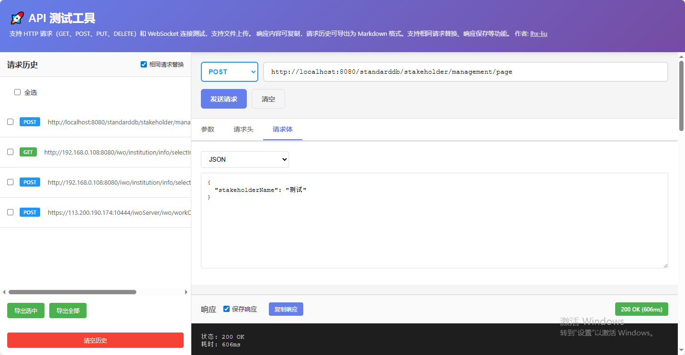

# API 测试工具使用说明

## 📖 工具简介

API 测试工具是一个功能强大的在线 HTTP 和 WebSocket 接口测试工具，支持多种请求方式、文件上传、请求历史管理等功能。无需安装任何插件，直接在浏览器中即可使用。

### 🔗 工具链接

**在线使用地址：** [https://lhx-liu.github.io/liuhaixu.github.io/tools/api-tester.html](https://lhx-liu.github.io/liuhaixu.github.io/tools/api-tester.html)

### 📸 工具界面

<div align="center">
  
  <p style="color: #666; font-size: 14px; margin-top: 8px;">API 测试工具主界面</p>
</div>

工具界面采用左右分栏设计：
- **左侧面板**：显示请求历史记录，支持快速回填和批量导出
- **右侧面板**：包含请求配置区域和响应展示区域
- **顶部导航**：显示工具标题和功能说明

---

## ✨ 核心功能

### 1. HTTP 请求支持

支持以下 HTTP 请求方法：
- **GET** - 获取资源
- **POST** - 创建资源或提交数据
- **PUT** - 更新资源
- **DELETE** - 删除资源

### 2. WebSocket 连接测试

- 支持 WebSocket 连接建立
- 实时消息发送和接收
- 连接状态显示
- 消息历史记录

### 3. 请求参数配置

#### 查询参数（Params）
- 支持 URL 查询参数配置
- 自动从 URL 解析参数
- 键值对形式管理

#### 请求头（Headers）
- 自定义请求头设置
- 支持常用请求头配置
- Content-Type 自动识别

#### 请求体（Body）
支持多种请求体格式：
- **JSON** - JSON 格式数据，自动格式化验证
- **Text** - 纯文本格式
- **Form Data** - 表单数据，支持文件上传
- **x-www-form-urlencoded** - URL 编码表单数据

### 4. 文件上传

- 支持通过 Form Data 上传文件
- 显示文件名称和大小
- 支持多文件上传

### 5. 响应展示

- 响应状态码和状态文本
- 请求耗时统计
- 响应头信息展示
- 响应体格式化显示（JSON 自动格式化）
- 响应内容一键复制

### 6. 请求历史管理

- 自动保存请求历史（最多 50 条）
- 历史记录快速回填
- 支持相同请求替换功能
- 历史记录导出为 Markdown 格式
- 支持批量选择和删除

### 7. 响应保存功能

- 可选择是否保存响应内容
- 响应内容随历史记录一起保存
- 导出时包含完整的请求和响应信息

---

## 🚀 使用指南

### 基本 HTTP 请求

1. **选择请求方法**
   - 在顶部下拉框选择 GET、POST、PUT 或 DELETE

2. **输入请求 URL**
   - 在 URL 输入框中输入完整的接口地址
   - 例如：`https://api.example.com/users`

3. **配置请求参数**
   - **参数标签页**：配置 URL 查询参数
   - **请求头标签页**：设置自定义请求头
   - **请求体标签页**：配置请求体内容（POST/PUT 请求）

4. **发送请求**
   - 点击"发送请求"按钮
   - 查看右侧响应区域的结果

### WebSocket 连接

1. **选择 WebSocket 模式**
   - 在请求方法下拉框选择 "WebSocket"

2. **输入 WebSocket URL**
   - 输入 WebSocket 服务器地址
   - 例如：`ws://localhost:8080/ws` 或 `wss://example.com/ws`

3. **建立连接**
   - 点击"连接"按钮建立 WebSocket 连接
   - 连接状态会显示在状态栏

4. **发送消息**
   - 在消息输入框输入要发送的内容
   - 点击"发送消息"按钮发送
   - 接收到的消息会显示在消息列表中

5. **断开连接**
   - 点击"断开"按钮关闭 WebSocket 连接

### 文件上传

1. **选择 Form Data 格式**
   - 在请求体标签页，选择 "Form Data" 类型

2. **添加文件字段**
   - 点击"+ 添加字段"按钮
   - 在值类型下拉框选择"文件"
   - 点击文件选择框选择要上传的文件

3. **发送请求**
   - 配置其他必要参数后发送请求
   - 文件会自动随请求一起发送

### 使用请求历史

1. **查看历史记录**
   - 左侧面板显示所有历史请求
   - 点击历史记录项可快速回填表单

2. **相同请求替换**
   - 勾选"相同请求替换"选项
   - 相同方法和 URL 的请求会自动替换，而不是新增

3. **导出历史记录**
   - 选择要导出的记录（可全选或单选）
   - 点击"导出选中"或"导出全部"
   - 自动下载 Markdown 格式的历史记录文件

4. **删除历史记录**
   - 鼠标悬停在历史记录上，点击"删除"按钮
   - 或使用复选框批量选择后删除

---

## 💡 使用技巧

### 1. URL 参数自动解析

在 URL 输入框中输入带参数的 URL，例如：
```
https://api.example.com/users?id=123&name=test
```

失去焦点后，工具会自动解析参数并填充到"参数"标签页，同时 URL 会变为：
```
https://api.example.com/users
```

### 2. JSON 格式验证

在请求体中选择 JSON 格式时，工具会自动验证 JSON 格式是否正确。如果格式错误，会提示错误信息。

### 3. 响应内容复制

点击响应区域的"复制响应"按钮，可以快速复制完整的响应内容（包括状态码、响应头、响应体）。

### 4. 请求历史回填

点击历史记录项，工具会自动：
- 填充请求方法和 URL
- 恢复请求参数、请求头、请求体
- 切换到对应的标签页

### 5. 响应保存控制

如果不需要保存响应内容（节省存储空间），可以取消勾选"保存响应"选项。这样历史记录中只会保存请求信息，不包含响应内容。

---

## 📋 功能特性详解

### 相同请求替换

启用"相同请求替换"功能后：
- 如果发送的请求方法和 URL 与历史记录中的某条相同
- 新请求会替换旧记录，而不是新增一条
- 适用于需要频繁测试同一个接口的场景

### 响应保存

启用"保存响应"功能后：
- 每次请求的响应内容都会保存到历史记录中
- 导出历史记录时会包含完整的响应信息
- 可以随时查看历史请求的响应内容

### 历史记录导出

导出的 Markdown 文件包含：
- 请求方法和 URL
- 请求参数、请求头、请求体
- 响应状态码、响应头、响应体
- 请求耗时和时间戳
- 格式化的 JSON 内容

---

## ⚠️ 注意事项

1. **跨域问题**
   - 如果目标 API 服务器未设置 CORS，浏览器可能会阻止请求
   - 建议在开发环境中使用，或确保服务器已配置 CORS

2. **WebSocket 协议**
   - 本地开发使用 `ws://` 协议
   - 生产环境使用 `wss://` 协议（加密）

3. **文件大小限制**
   - 文件上传受浏览器和服务器限制
   - 建议上传的文件不要过大

4. **历史记录存储**
   - 历史记录存储在浏览器本地存储（localStorage）中
   - 清除浏览器数据会删除所有历史记录
   - 建议定期导出重要历史记录

5. **隐私安全**
   - 所有请求数据仅存储在本地浏览器
   - 不会上传到任何服务器
   - 但请注意不要在公共设备上测试敏感接口

---

## 🎯 适用场景

- **API 接口调试**：快速测试后端接口是否正常工作
- **接口文档验证**：对照接口文档验证接口功能
- **WebSocket 测试**：测试 WebSocket 连接和消息收发
- **文件上传测试**：验证文件上传接口功能
- **接口性能测试**：查看请求耗时，评估接口性能
- **接口联调**：前后端联调时快速测试接口

---

## 📝 更新日志

### v1.0.0
- ✅ 支持 HTTP 请求（GET、POST、PUT、DELETE）
- ✅ 支持 WebSocket 连接测试
- ✅ 支持文件上传
- ✅ 请求历史管理
- ✅ 响应内容复制
- ✅ 历史记录导出为 Markdown
- ✅ 相同请求替换功能
- ✅ 响应保存功能

---

## 🤝 反馈与建议

如有任何问题或建议，欢迎通过以下方式反馈：

- GitHub Issues: [提交 Issue](https://github.com/lhx-liu/liuhaixu.github.io/issues)
- 作者主页: [lhx-liu](https://lhx-liu.github.io/liuhaixu.github.io/)

---

## 📄 许可证

本工具为开源工具，可自由使用。

---

<p align="center">© 2025 API 测试工具 | 让接口测试更简单</p>

