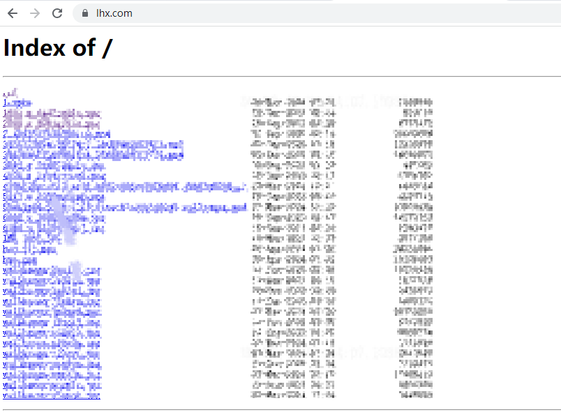

# Windows 10 本地开发环境 HTTPS 配置指南

## 目录
1. [简介](#简介)
2. [环境准备](#环境准备)
3. [生成自签名SSL证书](#生成自签名ssl证书)
4. [配置Nginx](#配置nginx)
5. [配置浏览器信任证书](#配置浏览器信任证书)
6. [测试访问](#测试访问)
7. [常见问题](#常见问题)

---

## 简介

本指南详细介绍如何在Windows 10系统上使用OpenSSL为本地开发环境配置HTTPS服务。通过创建自签名SSL证书，配置Nginx服务器，并让浏览器信任该证书，实现安全的HTTPS访问。

## 环境准备

### 1. 安装OpenSSL
- 下载并安装 [Git for Windows](https://git-scm.com/download/win)（包含OpenSSL）
- 或单独下载 [OpenSSL for Windows](http://slproweb.com/products/Win32OpenSSL.html)

### 2. 准备工作目录
```cmd
# 创建项目目录
mkdir D:\nginx-dev
cd /d D:\nginx-dev
```

### 3. 创建证书存储目录
```cmd
mkdir ssl
```

## 生成自签名SSL证书

### 1. 创建openssl.cnf配置文件

在 `D:\nginx-dev` 目录下创建 `openssl.cnf` 文件：

```ini
[req]
default_bits = 2048
prompt = no
default_md = sha256
distinguished_name = dn
req_extensions = v3_req

[dn]
C = CN
ST = Beijing
L = Beijing
O = My Organization
OU = IT Department
CN = lhx.com

[v3_req]
basicConstraints = CA:FALSE
keyUsage = nonRepudiation, digitalSignature, keyEncipherment
extendedKeyUsage = serverAuth
subjectAltName = @alt_names

[alt_names]
DNS.1 = lhx.com
DNS.2 = www.lhx.com
DNS.3 = 10.222.56.104
DNS.4 = localhost
IP.1 = 10.222.56.104
```

### 2. 生成SSL证书

打开命令提示符(cmd)，执行以下命令：

```cmd
# 生成私钥和证书（关键：添加 -extensions v3_req 参数）
openssl req -x509 -nodes -days 3650 -newkey rsa:2048 -keyout ssl/nginx.key -out ssl/nginx.crt -config openssl.cnf -extensions v3_req
```

### 3. 验证证书

```cmd
# 检查证书详细信息
openssl x509 -in ssl/nginx.crt -text -noout
```

您应该能看到包含以下内容的输出：
```
X509v3 extensions:
    X509v3 Basic Constraints: 
        CA:FALSE
    X509v3 Key Usage: 
        Digital Signature, Non Repudiation, Key Encipherment
    X509v3 Extended Key Usage: 
        TLS Web Server Authentication
    Subject Alternative Name: 
        DNS:lhx.com, DNS:www.lhx.com, DNS:10.222.56.104, DNS:localhost, IP Address:10.222.56.104
```

## 配置Nginx

### 1. 下载并解压Nginx

从 [nginx官网](https://nginx.org/en/download.html) 下载最新版本的Nginx，解压到 `D:\nginx-dev\nginx` 目录。

### 2. 修改nginx.conf配置文件

编辑 `D:\nginx-dev\nginx\conf\nginx.conf` 文件：

```nginx
worker_processes  1;

events {
    worker_connections  1024;
}

http {
    include       mime.types;
    default_type  application/octet-stream;

    sendfile        on;
    keepalive_timeout  65;

    server {
        listen       443 ssl;
        server_name  lhx.com www.lhx.com 10.222.56.104 localhost;

        ssl_certificate      D:/nginx-dev/nginx/ssl/nginx.crt;
        ssl_certificate_key  D:/nginx-dev/nginx/ssl/nginx.key;

        ssl_session_cache    shared:SSL:1m;
        ssl_session_timeout  5m;

        ssl_ciphers  HIGH:!aNULL:!MD5;
        ssl_prefer_server_ciphers  on;

        location / {
            root   html;
            index  index.html index.htm;
        }

        error_page   500 502 503 504  /50x.html;
        location = /50x.html {
            root   html;
        }
    }

    # 其他server块保持不变...
}
```

### 3. 启动Nginx

```cmd
cd /d D:\nginx-dev\nginx
nginx.exe
```

## 配置浏览器信任证书

### 1. 导出证书

将证书导出为 `.crt` 格式：
```cmd
# 如果需要转换格式
openssl x509 -in ssl/nginx.crt -out ssl/nginx.crt.pem
```

### 2. 添加到受信任的根证书颁发机构

1. 按 `Win + R`，输入 `certmgr.msc`，回车打开证书管理器
2. 在左侧导航树中，右键点击 **受信任的根证书颁发机构** → **所有任务** → **导入**
3. 点击 **下一步**
4. 点击 **浏览**，选择 `D:\nginx-dev\nginx\ssl\nginx.crt`
5. 点击 **下一步**
6. 选择 **将所有的证书都放入下列存储**，确保存储位置是 **受信任的根证书颁发机构**
7. 点击 **下一步** → **完成**
8. 系统会弹出安全警告，点击 **是** 确认

### 3. 重启浏览器

关闭所有浏览器窗口，然后重新打开浏览器。

## 测试访问

### 1. 配置本地域名解析

编辑 `C:\Windows\System32\drivers\etc\hosts` 文件（需要管理员权限）：
```
10.222.56.104 lhx.com
10.222.56.104 www.lhx.com
```

### 2. 访问网站

在浏览器地址栏输入：
- `https://lhx.com`
- 或 `https://10.222.56.104`

如果配置正确，应该看到绿色锁形图标，表示连接安全。

## 常见问题

### Q1: 为什么仍然显示不安全？
- **原因**: 证书缺少扩展密钥用法字段
- **解决**: 确保生成证书时使用 `-extensions v3_req` 参数

### Q2: 如何验证证书是否正确？
```cmd
openssl x509 -in ssl/nginx.crt -text -noout
```

### Q3: 如何更新证书？
1. 重新生成证书
2. 更新Nginx配置
3. 重新导入证书到受信任的根证书颁发机构

### Q4: 生产环境建议
- 使用Let's Encrypt等免费证书服务
- 或购买商业SSL证书
- 不要使用自签名证书用于生产环境

通过以上步骤，您就可以在Windows 10本地开发环境中成功配置HTTPS服务了。

### 效果展示

