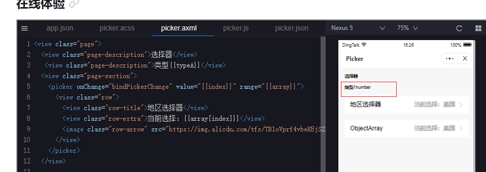

# uniapp钉钉小程序picker兼容性问题 🐞

> **问题类型**：兼容性问题 · **影响平台**：Android钉钉小程序 · **解决状态**：已解决 ✅

## 📋 问题描述

在钉钉小程序中使用 uniapp 的 picker 组件时，发现组件在 Android 平台上显示异常且无法正常选择值，但在钉钉模拟器和 iOS 真机上运行正常。


## ⚠️ 问题代码

```vue
<template>
  <view class="container index-box">
    <uni-forms ref="form" :modelValue="formData">
      <uni-forms-item required label="类型:" name="type">
        <picker :value="formData.type - 1" :range="pickerArr" @change="pickerChange($event, 'type')">
          <view class="pick-box">
            <view class="input-placeholder" v-if="formData.type === ''">
              请选择
            </view>
            <view class="input-value" v-else>{{pickerArr[formData.type - 1]}}</view>
            <view class="pick-empty"></view>
            <uni-icons type="right" size="18" color="#cccccc"></uni-icons>
          </view>
        </picker>
        <!-- 其他picker -->
      </uni-forms-item>
    </uni-forms>
  </view>
</template>

<script>
export default {
  data() {
    return {
      formData: {
        type: '',
      },
      pickerArr: ['一', '二', '三']
    };
  },
  methods: {
    /**
     * picker涉及的改动
     * @param {Object} e
     */
    pickerChange(e, type) {
      try {
        console.log('11111', typeof e.detail.value);
        const selectIndex = e.detail.value + 1;
        this.formData[type] = parseInt(selectIndex);
      } catch (e) {
        //TODO handle the exception
        console.error('改变枚举值失败', e);
      }
    },
  },
};
</script>
```

## 🔍 问题分析

经过测试和分析，发现 uniapp 的 picker 组件在不同平台上的回调函数返回值类型不一致：

| 平台类型 | 返回值类型 | 说明 |
|---------|-----------|------|
| 钉钉模拟器 | `number` | 正常工作 |
| iOS真机 | `number` | 正常工作 |
| Android真机 | `string` | ❌ 导致问题 |

> ⚠️ **根因**：uniapp 的 picker 组件在 Android 钉钉小程序上返回的是字符串类型，而在其他平台返回的是数字类型。目前尚不清楚具体原因，即使在钉钉在线体验平台上测试也返回的是数字类型。



## 💡 解决方案

找到根因后，解决方案就很简单了。在 [pickerChange](file:///f:/2.0liuhaixu/liuhaixu.github.io/随手记/uniapp钉钉小程序picker兼容性问题.md#L47-55) 方法中，将 `e.detail.value` 转换为数字类型即可：

```javascript {diff}
pickerChange(e, type) {
  try {
-   const selectIndex = e.detail.value + 1;
+   const selectIndex = parseInt(e.detail.value) + 1;
    this.formData[type] = parseInt(selectIndex);
  } catch (e) {
    //TODO handle the exception
    console.error('改变枚举值失败', e);
  }
},
```

## ✅ 最终代码

```javascript
pickerChange(e, type) {
  try {
    const selectIndex = parseInt(e.detail.value) + 1;
    this.formData[type] = parseInt(selectIndex);
  } catch (e) {
    //TODO handle the exception
    console.error('改变枚举值失败', e);
  }
},
```

## 📝 总结

这是一个典型的跨平台兼容性问题，在开发多端应用时需要注意不同平台的数据类型差异。建议在处理平台相关API返回值时，显式地进行类型转换以确保一致性。

| 项目 | 内容 |
|------|------|
| 问题等级 | 中等 |
| 影响范围 | 仅 Android 钉钉小程序 |
| 解决成本 | 低 |
| 预防措施 | 对平台API返回值进行类型检查和转换 |
