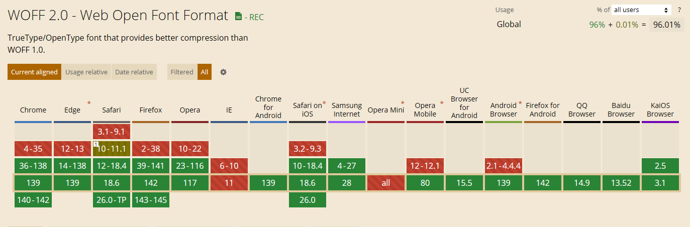
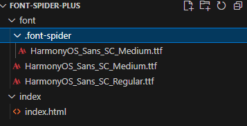
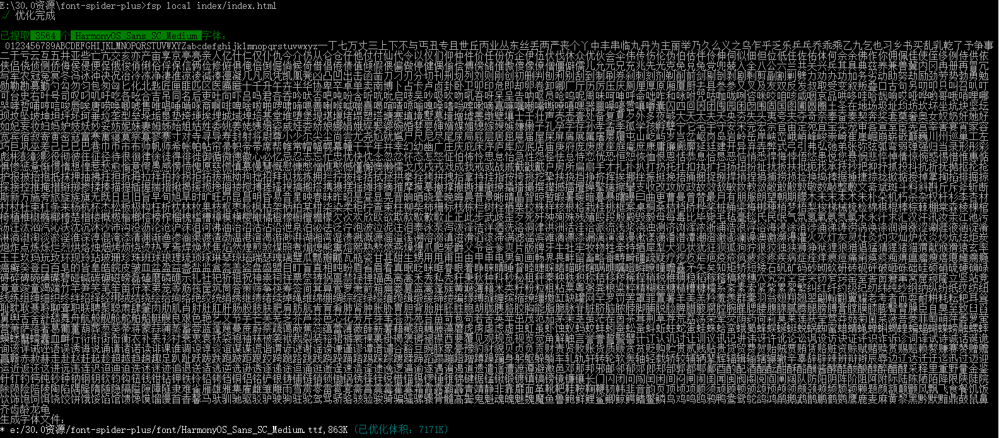

# 记一次移动端引用字体包太大的解决方案

## 背景

在做某移动端需求过程中，项目中使用了至少4种字体，4种字体的体积如下：

| 字体                     | 格式               | 体积    |
|--------------------------|--------------------|---------|
| DingTalk-JinBuTi         | TrueType 字体文件 | 2,080 KB |
| HarmonyOs_Sans_SC_Medium | TrueType 字体文件 | 8,035 KB |
| HarmonyOS_Sans_SC_Regular| TrueType 字体文件 | 8,068 KB |
| PingFangSC-Medium        | TrueType 字体文件 | 1,105 KB |

如果把上述字体放入项目的 `font` 目录下，项目的字体包体积为 17.5MB，打包移动端无论是小程序还是H5,最终打出来的包忒大，特别是小程序，对包的大小有严格限制

可以将字体包放到服务器上，使用@font-face引入字体，例如：

```css
@font-face {
  font-family: 'DingTalk-JinBuTi';
  src: url('https://xxxxxxx/fonts/HarmonyOS_Sans_SC_Regular.woff2') format('woff2');
}
```

但是这样引入，针对网络加载不友好，而且加载速度也慢，所以不建议使用直接使用tff格式的字体包。

## 解决方案

### 转换字体

4个字体的体积和为 17.5MB，这个体积太大了，而且这些字体都是同款字体，只是格式不同，所以可以尝试将这些字体压缩成 `woff2` 格式，并使用 `@font-face` 引入。

如果下载的字体为tff格式，这里可以推荐一个字体转换网站：[https://cloudconvert.com/ttf-to-woff2](https://cloudconvert.com/ttf-to-woff2)

注意：这里转换为woff2格式后 需要注意兼容性问题，woff2格式的字体在低版本的浏览器中不支持，如果出现兼容性问题，可以考虑使用 `woff` 格式。

转换后的字体大小为：

| 字体                     | 格式   | 压缩后体积 |
|--------------------------|--------|------------|
| DingTalk-JinBuTi         | WOFF2  | 985 KB     |
| HarmonyOs_Sans_SC_Medium | WOFF2  | 4,242 KB   |
| HarmonyOS_Sans_SC_Regular| WOFF2  | 4,180 KB   |
| PingFangSC-Medium        | WOFF2  | 560 KB     |

woff2兼容性



### 压缩字体

可以看出即鸿蒙系列字体，即使转换为woff2格式的字体，体积也比较大，所以还需要压缩字体。

这里我们可以使用 `font-spider` 压缩字体。

`font-spider` 是一个字体压缩工具，它可以压缩字体文件，只保留项目中使用的字体，其他字体都丢掉。

我们使用它的plus版本`font-spider-plus`，是社区基于`font-spider`的版本。

使用方法：

1. 安装 `font-spider-plus`

```bash
npm install font-spider-plus -g
```

2. 创建工程目录



`font`目录下是要压缩的字体文件
`index`下的`index.html`目录下是要保留的压缩的字体html文件。


其中index.html文件内容如下：

``` html
<div class="test">
    1234567890qwertyuiopasdfghjklzxcvbnmQWERTYUIOPASDFGHJKLZXCVBNM阿啊哎哀唉埃挨...
</div>
<style>
    @font-face {
        font-family: 'HarmonyOS_Sans_SC_Medium';
        src: url('../font/HarmonyOS_Sans_SC_Medium.ttf');
        font-weight: normal;
        font-style: normal;
    }
    .test{
        font-family: 'HarmonyOS_Sans_SC_Medium';
    }
</style>
```
上方我这里只保留了数字、大小写字母、常用3500中文字[3500字体](https://gitcode.com/Open-source-documentation-tutorial/cbaa0/blob/main/3500%E4%B8%AA%E5%B8%B8%E7%94%A8%E6%B1%89%E5%AD%97.txt)

你可以你根据你项目的使用自行更改
3. 执行压缩命令
```bash
$ fsp local index/index.html
```
执行过程如图：

压缩后会把压缩前的字体移动到 `font-spider` 目录下，压缩后的字体文件替换了之前压缩前的文件，如上图。

可以看到压缩后的字体文件大小只有 863KB,当然这换只是ttf格式的，如果换要压缩还可以将字体文件转为woff2格式。

## 对比

最终我们拿HarmonyOS_Sans_SC_Medium最对比

| 字体                     | 类型 | 大小    |
|--------------------------|------|---------|
| HarmonyOS_Sans_SC_Medium | 原始ttf | 8,035 KB |
| HarmonyOS_Sans_SC_Medium | 原始ttf转woff2 | 4,242 KB |
| HarmonyOS_Sans_SC_Medium | 原始ttf经过font-spider压缩 | 863 KB |
| HarmonyOS_Sans_SC_Medium | 原始ttf经过font-spider压缩再转woff2 | 863 KB |

